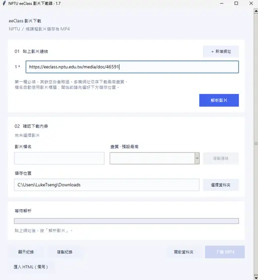
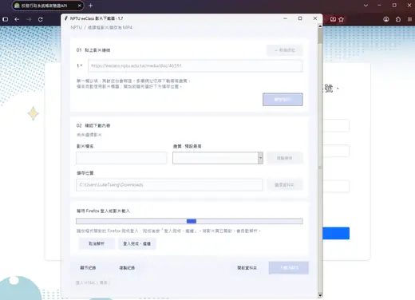
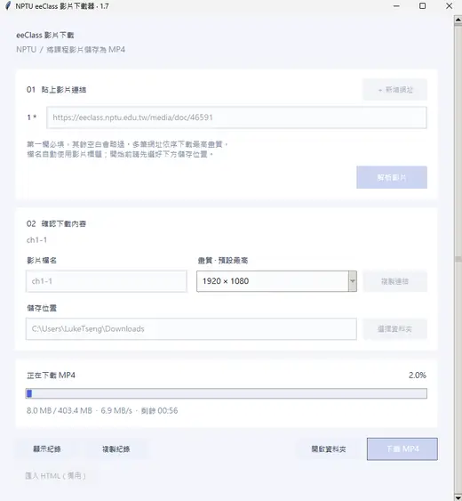
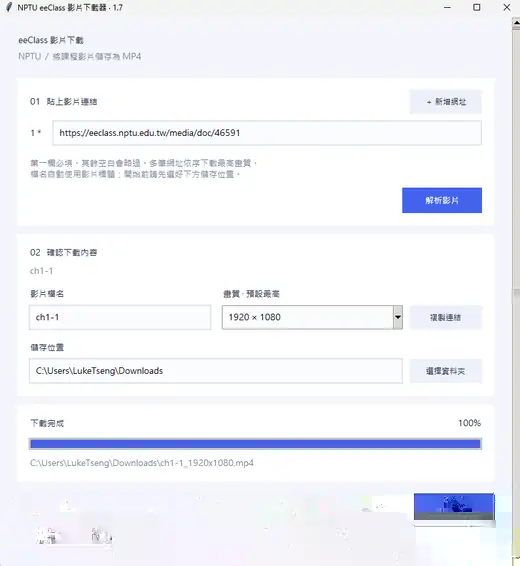

# NPTU eeClass 影片下載器

Windows 圖形介面工具，將你已可觀看的國立屏東大學 eeClass 影片下載為 MP4。貼上影片頁面網址後，由專用 Firefox 讀取播放器資料並提供畫質選擇。

目前版本：**1.7，Windows EXE 版**。本專案提供影片下載，尚未提供格式轉換或重新編碼。

## 操作畫面

| 貼上影片連結 | Firefox 登入／影片載入 |
| --- | --- |
|  |  |
| **下載進行中** | **下載完成** |
|  |  |

## Windows 一般使用者

下載 [v1.7.0 Windows 免安裝版](https://github.com/LukeTsengTW/nptu-eeclass-video-downloader/releases/tag/v1.7.0) 的 `eeClass-v1.7.0-Windows-x64.zip`，解壓縮後雙擊 `eeClass-Downloader.exe`。壓縮包包含 EXE、快速說明、第三方授權與 SHA-256 校驗碼，共 4 個檔案。

**不必安裝 Python、pip、Selenium、yt-dlp 或 FFmpeg。** 若電腦已有可用 Firefox 就直接使用；沒有時才下載並重用專用瀏覽器。支援 Windows 10／11 x64，不要求系統管理員權限。首次瀏覽器準備需要網路。

貼上單支影片網址後按「解析影片」，在專用 Firefox 正常登入，再選畫質並下載。多支影片使用「＋ 新增網址」與「批次下載」。詳細操作見 [Windows 快速開始](Windows快速開始.txt)。

成品是單一 EXE，Python 與下載元件已內建；單檔執行時會暫時解壓縮執行元件，瀏覽器與登入快取則使用固定的 AppData 位置。未使用程式碼簽章，Windows 可能顯示未知發行者提示。隨附 SHA-256 校驗值與第三方授權資訊。

## 從原始碼執行（開發者）

1. 安裝 Python 3.10 以上（包含 Tcl/Tk、pip、venv）。不必預先安裝 Firefox。
2. 安裝 yt-dlp，或保留原先可用的 yt-dlp 安裝。使用相同 Python 環境安裝的指令為：

   ```powershell
   py -3 -m pip install -r requirements.txt
   ```

3. 雙擊 `開啟_eeClass影片下載器.vbs`。若系統停用 VBScript，可雙擊 `啟動_eeClass影片下載器.bat`，或執行 `py -3 eeclass_gui.pyw`。
4. 貼上 eeClass 影片頁面網址，按「解析影片」。
5. 第一次請在程式開啟的專用 Firefox 視窗登入。若登入後仍未顯示畫質，回到下載器按「登入完成，繼續」。
6. 確認畫質、檔名與儲存位置後，按「下載 MP4」。

原始碼版需要 Python；一般使用者請下載上方 EXE 成品。專用 Firefox 與日常使用的 Firefox 使用不同設定檔，第一次需要另外登入。登入是否能保留至下次使用，依網站的登入期限與 Cookie 規則而定。

## 批次下載

按「＋ 新增網址」即可增加一個欄位，額外欄位旁的「−」可以移除該欄。第一個網址欄位必填，之後的空白欄位（包含只有空格）會自動略過；有填寫的網址會在開始前一起檢查，格式不正確時顯示欄位編號。

只有一筆有效輸入時，仍使用原本的「解析影片 → 選擇畫質 → 下載 MP4」流程。填入兩筆以上時，按鈕會變成「批次下載（筆數）」：先選好儲存資料夾，再按此按鈕，程式會依輸入順序逐支解析並下載最高畫質，不需每支重新按下載。登入需要人工操作時，會沿用既有的 Firefox 登入提示。

批次檔名採「三位序號＋影片標題＋解析度」，例如 `001_課程一_1920x1080.mp4`。遇到同名影片、已有 MP4 或未完成的 `.part`／`.ytdl` 檔會另取名稱，避免覆寫或接續其他影片。每支影片各自取得目前登入資料，下載完成或失敗後清除暫存 Cookie。

下方清單顯示每支影片的狀態，詳細失敗原因可從紀錄查看。單支失敗會繼續處理下一支；「完成此支後停止」會完成目前影片再停止，「取消解析」則取消目前解析並停止整個批次。結束時顯示成功、失敗與未完成數量。批次執行期間會鎖定網址與儲存位置，避免任務中途被更動。

「匯入 HTML（備用）」僅供單支影片使用，多筆網址時會停用。批次清單目前不會保存至下次開啟，也不提供跨次恢復任務。

## 自動化元件與資料位置

EXE 已包含 `selenium==4.50.0` 與 yt-dlp，不會呼叫系統 Python 或安裝虛擬環境。只有原始碼版才會在 `%LOCALAPPDATA%\NPTUeeClassDownloader` 建立獨立 Python 環境並安裝 Selenium；Selenium Manager 負責取得缺少的 Firefox 與 geckodriver。首次缺少瀏覽器或驅動時需要可連線至 Mozilla 與 geckodriver 下載來源；只有原始碼版另外需要 PyPI。

瀏覽器依下列順序選擇：

1. 電腦已安裝、可執行的 Firefox。
2. 上次使用的可用副本，以及程式或 Selenium 已下載的 Firefox 快取。
3. 都找不到時，才下載專用 Firefox 至 `%LOCALAPPDATA%\NPTUeeClassDownloader\browser-cache`，不進行系統安裝。

同一個 Windows 使用者帳號下，移動或重新下載本專案仍共用上述目錄，不會每個專案資料夾各存一份瀏覽器。正常重開會直接使用已驗證的瀏覽器與驅動程式，不會每次解析都另下載一套新版。系統 Firefox 更新、元件被刪除或快取損壞時，會重新檢查需要的元件。若兩個下載器同時進行首次設定，後啟動的程式會等待並重用結果；同一個瀏覽器設定檔仍應一次只由一份下載器使用。

既有 Selenium 快取預設為 `%USERPROFILE%\.cache\selenium`，若設定 `SE_CACHE_PATH` 則使用該路徑。程式只清理自身 `browser-cache` 中無法通過執行檢查的 Firefox 版本目錄，不刪除系統 Firefox 或其他程式的快取；Selenium Manager 的快取維護則依其本身規則運作。瀏覽器與驅動程式通過執行檢查後才寫入 `browser-assets.json`，下載失敗不會留下「設定完成」標記。

同一目錄下的 `firefox-profile` 保存專用瀏覽器的設定與網站登入狀態。程式不代填密碼，也不將 Cookie 值寫入診斷紀錄。下載時會暫時提供目前 eeClass Cookie 給 yt-dlp，完成或出錯後清除暫存檔；若程序遭作業系統強制終止，暫存檔可能來不及清除。

## 備用方式與限制

- 「匯入 HTML（備用）」保留已成功使用的手動流程，此方式仍需要原有 Firefox 設定檔中的登入 Cookie；沒有自行安裝 Firefox 的使用者請使用自動解析。詳見 [使用說明](使用說明.txt)。
- 僅支援 NPTU eeClass HTTPS 上、帳號已可觀看的普通 MP4；不處理 DRM 或影片重新編碼。
- 等待登入期間可取消解析；首次套件與瀏覽器準備不會立即取消；MP4 下載期間尚無取消按鈕。
- 關閉下載器時會結束它開啟的專用 Firefox；目前操作需先完成或取消。

## 開發與驗證

主程式為 `eeclass_video_downloader.py`，`eeclass_gui.pyw` 提供無主控台啟動與啟動錯誤提示。介面使用 Python 內建的 Tk/ttk。`requirements.txt` 列出下載器相依套件；原始碼版的 Selenium 由程式自動安裝到獨立環境，EXE 則使用內建元件。

執行離線測試（需要 Python 的 Tk 模組，但不會開啟 GUI）：

```powershell
py -3 -m unittest discover -s tests -p "test_eeclass*.py"
```

其他系統可使用 `python` 取代 `py -3` 執行測試。測試涵蓋解析、TLS 相容處理、Cookie、模擬登入與取消、頁面範圍檢查，以及下載完成／失敗後的暫存清理。測試使用合成資料與瀏覽器替身，不需要學校帳號。

目前 89 項離線測試通過，包含瀏覽器元件管理、第一欄必填、空白略過、新增／移除欄位、循序批次下載、失敗繼續、停止／取消、過期事件隔離、檔名衝突及 Cookie 清理。使用者已確認 1.3 的手動 HTML 匯入能成功下載；**eeClass 真實帳號登入與課程影片的單支／批次下載仍需在使用者電腦驗證**。Windows 建置另外測試實際 EXE 的 GUI 初始化、背景程序、Selenium Manager、Firefox 空白頁操作與本機 HTTP 影片傳輸；是否通過請以該次 Actions 結果為準。

回報問題時請附版本、Windows／Python／Firefox 版本與「複製紀錄」內容。請勿上傳登入 Cookie、瀏覽器設定檔或含私人資料的完整 HTML。

## 建置 EXE

請在 Windows x64 與 Python 3.13 的獨立環境執行：

```powershell
py -3.13 -m venv .venv-build
.\.venv-build\Scripts\python.exe -m pip install -r requirements-build.txt
.\.venv-build\Scripts\python.exe -m unittest discover -s tests -p "test_eeclass*.py"
.\.venv-build\Scripts\python.exe scripts/build_windows.py
.\.venv-build\Scripts\python.exe scripts/smoke_windows.py dist/eeClass-Windows-x64/eeClass-Downloader.exe
```

成品位於 `dist/eeClass-Windows-x64`。GitHub Actions 在 Windows runner 上自動執行同一流程，測試成功後才上傳成品，保留 90 天。原始碼 ZIP 不包含已編譯 EXE；一般使用者請下載上方 Release，開發者可使用 Actions 成品。

使用 PyInstaller console bootloader 的 `hide-early` 模式，雙擊時隱藏主控台，同時保留背景程序需要的標準輸入／輸出；少數電腦啟動時可能短暫閃現主控台。背景瀏覽器與 yt-dlp 由同一 EXE 的內部工作模式執行，不會遞迴開啟 GUI。

## 技術參考

- [Selenium Manager](https://www.selenium.dev/documentation/selenium_manager/)
- [geckodriver 設定檔](https://firefox-source-docs.mozilla.org/testing/geckodriver/Profiles.html)
- [Selenium 4.50.0](https://pypi.org/project/selenium/4.50.0/)
- [yt-dlp](https://github.com/yt-dlp/yt-dlp)

## 授權

本專案原創程式碼與文件採用 [MIT License](LICENSE)，Copyright (c) 2026 LukeTsengTW。允許使用、修改、散布與商業使用，散布時須保留著作權與授權聲明；軟體不提供任何擔保。

Python、Selenium、yt-dlp、PyInstaller 與其他第三方元件仍依各自授權條款使用，相關聲明隨建置成品提供。MIT 授權不涵蓋課程影片、學校標誌或其他第三方內容。本工具由社群開發，非國立屏東大學官方軟體。